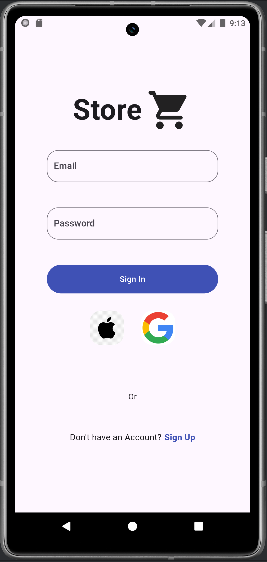
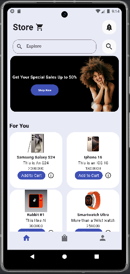
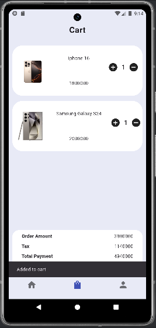
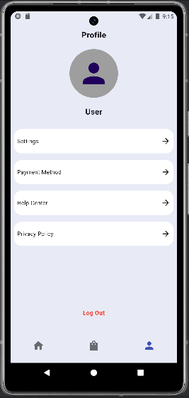

# Electronics Store Flutter App

This is a mobile application built using the **Flutter** framework, designed for an electronics store. The app allows users to browse, search, and purchase a wide variety of electronic products. Additionally, users can view product details, manage their cart, and make secure payments through the app.

## Features

- **Product Browsing**: Browse a wide range of electronics such as phones, laptops, TVs, and accessories.
- **Search Functionality**: Easily search for products by name, category, or brand.
- **Product Details**: View detailed information about each product including specifications, images, and pricing.
- **User Authentication**: Sign up, log in, and manage user profiles securely.
- **Shopping Cart**: Add products to the cart, update quantities, and remove items.
- **Checkout and Payment**: Proceed to checkout and make secure payments using various payment methods.
- **Order History**: View past orders and track delivery status.
- **Push Notifications**: Receive updates on new products, sales, and order status.

## Screenshots

